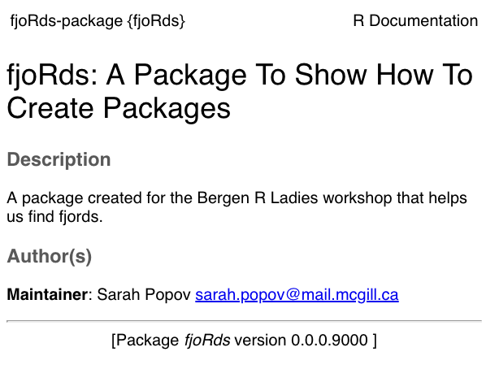
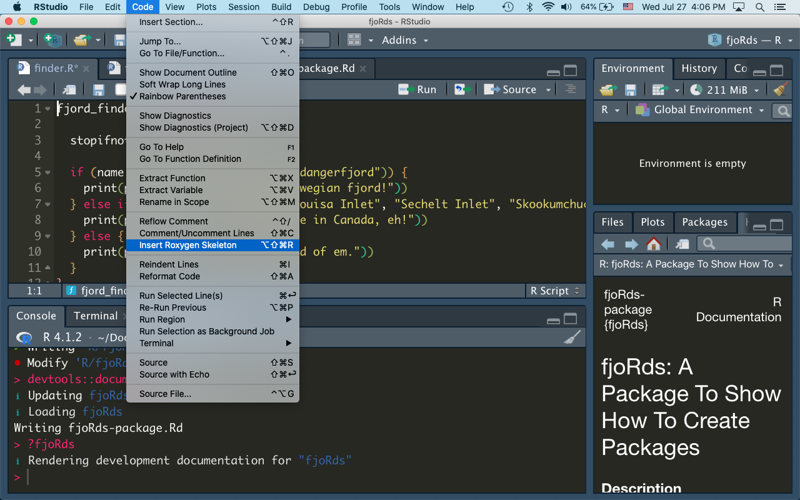
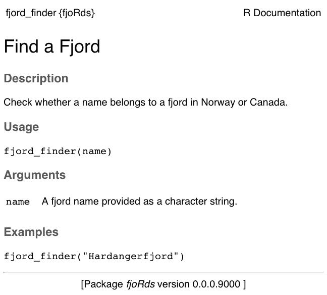
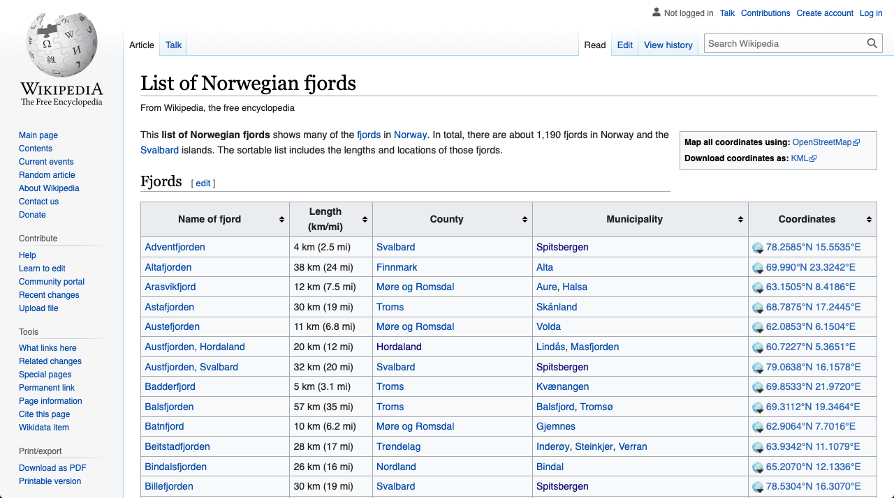
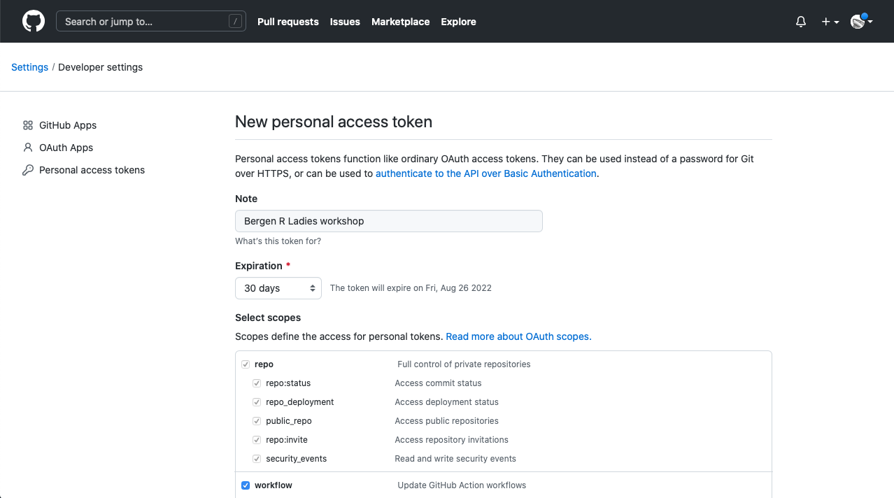
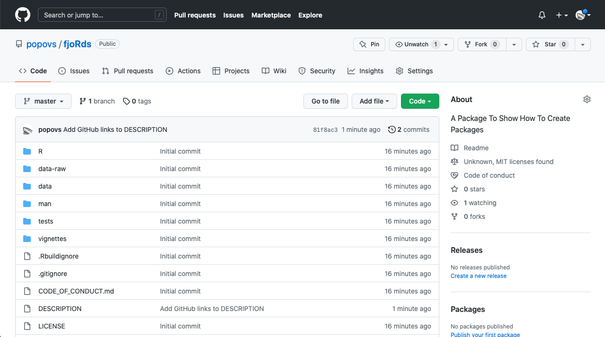
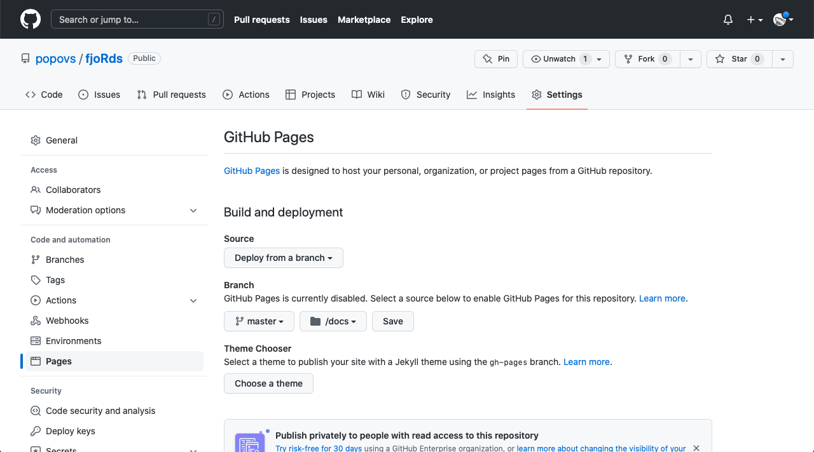
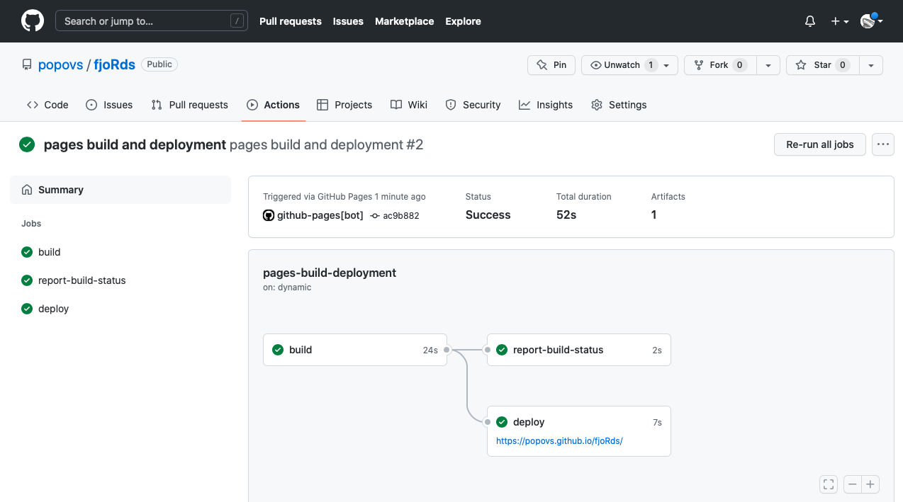

class: title-slide, bottom

.bold[Build your first R package]

Sarah Popov | August 2022

<p style="font-size:30px;">
`r icons::fontawesome('github')` [popovs](https://github.com/popovs)
<p>
<p style="font-size:20px;">
`r icons::fontawesome('info')` 
[Original blog post](https://www.rostrum.blog/2019/11/01/usethis/) | 
[Slide source](https://github.com/popovs/r-pkg-slides)
<p>
<p style="font-size:20px;">
`r icons::fontawesome('keyboard')` Press &#8592; &#8594; to navigate, P for presenter notes, F for full screen
<p>

---
class: inverse, middle

Easier R packages with {usethis}

???
* What do I mean by easy?
* You can write the whole thing from scratch, which uses multiple files and languages
* Or you can use some shortcuts thanks to some packages

---
class: middle

`r emo::ji("package")`

Goal: create an R package quickly and simply with {usethis}

---
class: middle

Some useful tutorials:

* Hilary Parker's [post](https://hilaryparker.com/2014/04/29/writing-an-r-package-from-scratch/)
* Matt Dray's [blog post](https://www.rostrum.blog/2019/11/01/usethis/), which this tutorial is based on!
* Patricio R Estévez-Soto's [tutorial](https://www.prestevez.com/post/r-package-tutorial/#tests)
* Tomas Westlake's [update](https://r-mageddon.netlify.com/post/writing-an-r-package-from-scratch/)
* Emil Hvitfeldt’s {usethis} [post](https://www.hvitfeldt.me/blog/usethis-workflow-for-package-development/)
* Karl Broman's [site](https://kbroman.org/pkg_primer/)
* Hadley Wickham's [book](http://r-pkgs.had.co.nz/)

---
class: middle

But first: some fjrods
<center></center>
???
* We're in Norway, so there's plenty of pretty fjords!
* Something that ties us together, me coming from BC and you all in Norway... 
* It will become apparent why I've brought this up. These fjords will be our programmatic muses
---
class: middle

`r emo::ji("raising_hand")`

Who has:

* used R?
* written a function?
* written a package?
---
class: inverse, middle

Let's talk functions
---
class: middle

What _is_ a function?

Why make one?
???
* A command that does a thing, like `read.csv()`
* Provide arguments to inform its behaviour, like `read.csv(file = "data.csv")`
* Prevents you repeating yourself and abstracts away a bunch of code
* You can write your own functions with the `function() {}` syntax
---
class: middle

What _is_ a package?

Why make one?
???
* A collection of functions (usually)
* Practically, it's a folder containing code, documentation and some other special files in a particular format
* Themed to perform certain type of task (usually), like plotting
* Shareable (via a GitHub repository, published on CRAN, or even as a zipped folder)
* You can write your own packages, but 
---
class: inverse, middle
background-image: url("img/hex_small.jpg")
background-size: cover
???
* Some packages are built into R already; you can install more
* Examples: {readr} to read files, {dplyr} to manipulate data, {ggplot2} to plot data
* Image by Amelia McNamara
---
class: inverse, middle

Minimal package example
???
* Let's build a simple, (nearly) pointless package to illustrate the process
* It's going to start out _very_ simple; just a single function
* It won't even have full documentation, but we'll add it later
---
class: middle

Packages to help make packages

```{r eval=FALSE}
install.packages("devtools", "usethis")

library(devtools)
library(usethis)
```
<center></center>
???
* {devtools} is a general purpose package for developing packages
* {usethis} is a package of functions for setting up your own package
---
class: middle

Create package folder and files `r emo::ji("new")`

```{r eval=FALSE}
usethis::create_package("~/Documents/R/fjoRds")

# ✔ Creating '/Users/sarahpopov/Documents/R/fjoRds/'
# ✔ Setting active project to '/Users/sarahpopov/Documents/R/fjoRds'
# ✔ Creating 'R/' #<<
# ✔ Writing 'DESCRIPTION' #<<
# ✔ Writing 'NAMESPACE' #<<
# ✔ Writing 'fjoRds.Rproj' #<<
# ✔ Adding '^fjoRds\\.Rproj$' to '.Rbuildignore'
# ✔ Adding '.Rproj.user' to '.gitignore'
# ✔ Adding '^\\.Rproj\\.user$' to '.Rbuildignore'
# ✔ Opening '/Users/sarahpopov/Documents/R/fjoRds/' in new RStudio session #<<
```
???
* A package is a folder containing a bunch of files; `create_package()` creates these for you
* You can see a bunch of files are created in the R/ directory - a skeleton of a package was created. We'll get to all of them in time
* Some of the files contain the functions, other files are for documentation, for example
* If you run the line from within RStudio, it automatically creates an RStudio (.Rproj) file for your new package and opens it
* I'm using the `package::function()` convention throughout so you know what package each function is from
---
class: middle

The resulting file structure

```{r eval=FALSE}
fjoRds/
  ├── man/
  ├── R/  #<<
  ├── fjoRds.Rproj
  ├── DESCRIPTION  #<<
  └── NAMESPACE
```
???
* This is the basic package folder skeleton created by `create_package()`
* We can add to/edit `R/` and `DESCRIPTION`
# `R/` is where our function scripts will go
* `DESCRIPTION` is where information about the package goes
* Don't touch `man/` and `NAMESPACE`; we can use functions later to fill these for us
* `man/` is where documentation (in a special format) will live
* `NAMESPACE` is a sort-of 'lookup' for object names
* There were some hidden files added too (`.gitignore` and `.buildignore` that we don't need to worry about now)
---
class: middle

Create a script file for functions

```{r eval=FALSE}
usethis::use_r("finder")

# ● Modify 'R/finder.R'
```
???
* Obviously we need to add functions to our package
* They go in R script files in the `R/` folder
* `use_r()` creates a script file (`finder.R`) with the provided string argument as its name
* It will open automatically in RStudio
* You would typically create multiple script files, where functions with the same 'theme' go in the same script file
---
class: middle

Script added to `R/`!

```{r eval=FALSE}
fjoRds/
  ├── man/
  ├── R/
  |   └── finder.R #<<
  ├── fjoRds.Rproj
  ├── DESCRIPTION
  └── NAMESPACE
```
---
class: middle

Add functions to `R/finder.R` `r emo::ji("technologist")`

```{r eval=FALSE}
fjord_finder <- function(name) {
  
  stopifnot(is.character(name))
  
  if (name %in% c("Sognefjord", "Hardangerfjord")) {
    print(paste(name, "is a nice Norwegian fjord!"))
  } else if (name %in% c("Princess Louisa Inlet", "Sechelt Inlet", "Skookumchuck Narrows")) {
    print(paste(name, "- I see you're in Canada, eh!"))
  } else {
    print(paste0(name, "? Never heard of em."))
  }
}
```
???
* Just going to add one silly one now
* This isn't function-writing best practice, but will do for now
* What does this function do?
---
class: middle

Document it `r emo::ji("document")`

```{r eval=FALSE}
devtools::document()

# ℹ Updating fjoRds documentation
# ℹ Loading fjoRds
```
???
* The only real change here is the addition of the function to the `NAMESPACE`
* Which allows the function to be exposed to the user
---
class: middle

Use the function! `r emo::ji("cat2")`

```{r eval=FALSE}
fjord_finder("Sognefjord")

# "Sognefjord is a nice Norwegian fjord!"

fjord_finder("Sechelt Inlet")

# "Sechelt Inlet - I see you're in Canada, eh!"

fjord_finder("Illulissat")

# "Illulissat? Never heard of em."
```
???
* We could stop here, but this isn't that useful
* What's missing?
* Obviously more functions, but also the documentation for them
* People can't use the functions if they don't know what they do or how to use them
---
class: inverse, middle

Add internal documentation
???
* What do I mean by internal documentation?
* I mean the documentation that can be accessed throgh the package with `help(function)` or `?function`
---
class:middle

<center></center>

Basic approach:

1. Write `roxygen2` descriptions
1. Run `devtools::document()`
1. `.Rd` file generated
1. Call `?package_name` or `?function_name` as needed

???
* What is `roxygen2`? It's a way to document your package and functions. Basically, you write metadata, and `roxygen2` automatically 'translates' that into R help files.
* You don't need to download or install `roxygen2` separately. It is already part of your `devtools` installation.
---
class: middle

With that knowledge, let's now add documentation for our package! Let's document:

* the package by editing `DESCRIPTION`
* each function by editing `.R` files
---
class: middle

Edit the `DESCRIPTION`

```{r eval=FALSE}
Package: fjoRds
Title: A Package To Show How To Create Packages #<<
Version: 0.0.0.9000
Authors@R: #<<
    person(given = "Sarah", #<<
           family = "Popov", #<<
           email = "sarah.popov@mail.mcgill.ca", #<<
           role = c("aut", "cre")) #<<
Description: A package created for the Bergen R Ladies workshop that helps us find fjords. #<<
License: `use_mit_license()`, `use_gpl3_license()` or friends to pick a license
Encoding: UTF-8
Roxygen: list(markdown = TRUE)
RoxygenNote: 7.1.2
```
???
* The `DESCRIPTION` file describes the package: what, who, etc
* You can adapt and add to this template
* For now, just update the highlighted lines
* This will be turned into documentation that will say what the package does
---
class: middle

Start documenting the package by altering the `DESCRIPTION`

```{r eval=FALSE}
usethis::use_package_doc()

# ✔ Writing 'R/fjoRds-package.R'
# • Modify 'R/fjoRds-package.R'

devtools::document()

# ℹ Updating fjoRds documentation
# ℹ Loading fjoRds
# Writing fjoRds-package.Rd #<<
```
---
class: middle

An `.Rd` was generated in `man/`!

```{r eval=FALSE}
fjoRds/
  ├── man/
  |   └── fjoRds-package.Rd #<<
  ├── R/
  |   ├── fjoRds-package.R #<<
  |   └── finder.R
  ├── fjoRds.Rproj
  ├── DESCRIPTION
  └── NAMESPACE
```
???
* .Rd files are the ones that R interprets as documentation
* These are generated when we run `devtools::document()`
* It turns the format of the `DESCRIPTION` file into the format in an `.Rd`
---
class: middle

A peek at the `.Rd` file

```{r eval=FALSE}
% Generated by roxygen2: do not edit by hand #<<
% Please edit documentation in R/fjoRds-package.R #<<
\docType{package}
\name{fjoRds-package}
\alias{fjoRds}
\alias{fjoRds-package}
\title{fjoRds: A Package To Show How To Create Packages}
\description{
A package created for the Bergen R Ladies workshop that helps us find fjords.
}
\author{
\strong{Maintainer}: Sarah Popov \email{sarah.popov@mail.mcgill.ca}

}
\keyword{internal}
```
???
* It would've been a pain to write this by hand
* The `.Rd` extension is 'roxygen2 documentation'
* It's in a kind of LaTeX implementation
* This is what the `DESCRIPTION` file was converted to so it can be rendered as a help page
---
class: middle

Now we can run `?fjoRds` to get some info about our package:

<center></center>

---
class: middle

We should do this for our function, too.
---
class: middle

Add roxygen2 comments above functions

```{r}
#' @title Find a Fjord #<<
#' @description Check whether a name belongs to a fjord in Norway or Canada. #<<
#' @param name A fjord name provided as a character string. #<<
#' @export  #<<
#' @examples #<<
#' fjord_finder("Hardangerfjord") #<<
fjord_finder <- function(name) {

  stopifnot(is.character(name))

  if (name %in% c("Sognefjord", "Hardangerfjord")) {
    print(paste(name, "is a nice Norwegian fjord!"))
  } else if (name %in% c("Princess Louisa Inlet", "Sechelt Inlet", "Skookumchuck Narrows")) {
    print(paste(name, "- I see you're in Canada, eh!"))
  } else {
    print(paste0(name, "? Never heard of em."))
  }
}
```
???
* Add these lines above the function in `R/finder.R`
* Possibly the trickiest part of the process, because you may not have seen roxygen before
* Special comment block (`#'`) followed by `@thing` to provide info about the function
* Includes title (`@title`), description (`@description`), the arguments (`@param`), etc
* `@export` is included so that the function is made available to package users (yes, you can have internal package functions that are never exposed to a user!)
* Other sections that can be added, but we won't worry about those now
---
class: middle

That's a lot to remember. Luckily, RStudio has a handy shortcut! `Code > Insert Roxygen skeleton`

<center></center>

---
class: middle

And `document()` again

```{r eval = FALSE}
devtools::document()

# ℹ Updating fjoRds documentation
# ℹ Loading fjoRds
# Writing NAMESPACE
# Writing fjord_finder.Rd #<<
```
---
class: middle

The `fjord_finder` roxygen block was also converted to `.Rd`!

```{r eval=FALSE}
fjoRds/
  ├── man/
  |   ├── fjoRds-package.Rd
  |   └── fjord_finder.Rd #<<
  ├── R/
  |   ├── fjoRds-package.R
  |   └── finder.R
  ├── fjoRds.Rproj
  ├── DESCRIPTION
  └── NAMESPACE
```
---
class: middle

Now you can see documentation

```{r eval=FALSE}
?fjord_finder

# ℹ Rendering development documentation for "fjord_finder"
```
<center></center>
???
* This will appear in the 'help' pane of RStudio
* Now people can see what the function is for
* And see what the arguments are and how to use it
---
class: inverse, middle

Add longer-form documentation
???
* A README (general package introduction, how to install, etc; useful for GitHub landing page)
* Focused vignettes to explain how to do particular tasks
---
class: middle

Add a README `r emo::ji("memo")`

```{r eval=FALSE}
usethis::use_readme_md()

# ✔ Writing 'README.md'
# • Modify 'README.md'
# • Update 'README.md' to include installation instructions.
```
???
* This is added to the project home directory
* It's partially pre-filled to give you an idea of what the content should be
* File will open automatically in RStudio for editing
* I've called this 'external' because it gets rendered nicely as a sort of 'homepage' for the package on GitHub
---
class: middle

Add walkthrough vignettes

```{r eval=FALSE}
usethis::use_vignette("find_fjords")

# ✔ Adding 'knitr' to Suggests field in DESCRIPTION
# ✔ Setting VignetteBuilder field in DESCRIPTION to 'knitr'
# ✔ Adding 'inst/doc' to '.gitignore'
# ✔ Creating 'vignettes/' #<<
# ✔ Adding '*.html', '*.R' to 'vignettes/.gitignore'
# ✔ Adding 'rmarkdown' to Suggests field in DESCRIPTION
# ✔ Writing 'vignettes/find_fjords.Rmd' #<<
# • Modify 'vignettes/find_fjords.Rmd' #<<
```
???
* This creates an R Markdown file in `vignettes/`
* Adds packages for rendering the R Markdown file to 'Suggests' in the `DESCRIPTION`
* File will open automatically in RStudio for editing
* Vignettes are arguably 'internal', but we're going to expose them on the internet
---
class: middle

You guessed it

```{r eval=FALSE}
devtools::document()

# ℹ Updating fjoRds documentation
# ℹ Loading fjoRds
# Writing NAMESPACE
# Writing NAMESPACE
```
---
class: middle

The new documentation will help people use the package

```{r eval=FALSE}
fjoRds/
  ├── man/
  |   ├── fjoRds-package.Rd
  |   └── fjord_finder.Rd
  ├── R/
  |   ├── fjoRds-package.R
  |   └── finder.R
  ├── vignettes/ #<<
  |   └── find_fjords.Rmd #<<
  ├── fjoRds.Rproj
  ├── DESCRIPTION
  ├── NAMESPACE
  └── README.md #<<
```
---
class: inverse, middle

Use other packages in your function code
???
* I only used base functions in the package
* What if I want to refer to functions from other packages?
---
class: middle

Let's use {glue} instead of `paste()`

```{r eval=FALSE}
fjord_finder <- function(name) {

  stopifnot(is.character(name))

  if (name %in% c("Sognefjord", "Hardangerfjord")) {
    print(glue::glue("{name} is a nice Norwegian fjord!")) #<<
  } else if (name %in% c("Princess Louisa Inlet", "Sechelt Inlet", "Skookumchuck Narrows")) {
    print(glue::glue("{name} - I see you're in Canada, eh!")) #<<
  } else {
    print(paste0(name, "? Never heard of em."))
  }
}
```
???
* Use the `package::function` convention
---
class: middle

Notice we did NOT do this: 

```{r eval = FALSE}
library(glue) # NO!! ❌🆘🙅 #<<

fjord_finder <- function(name) {
  
  stopifnot(is.character(name))
  
  if (name %in% c("Sognefjord", "Hardangerfjord")) {
    print(glue("{name} is a nice Norwegian fjord!")) #<<
  } else if (name %in% c("Princess Louisa Inlet", "Sechelt Inlet", "Skookumchuck Narrows")) {
    print(glue("{name} - I see you're in Canada, eh!")) #<<
  } else {
    print(paste0(name, "? Never heard of em."))
  }
}
```
---
class: middle

When referencing other package function inside your own package, always use `package::function()` notation.
---
class: middle

Add {glue} to the package

```{r eval=FALSE}
usethis::use_package("glue")

# ✔ Adding 'glue' to Imports field in DESCRIPTION #<<
# • Refer to functions with `glue::fun()`
```
---

Package name added to 'Imports' in `DESCRIPTION`

```{r eval=FALSE}
Package: fjoRds
Title: A Package To Show How To Create Packages
Version: 0.0.0.9000
Authors@R: 
    person(given = "Sarah", 
           family = "Popov", 
           email = "sarah.popov@mail.mcgill.ca", 
           role = c("aut", "cre")) 
Description: A package created for the Bergen R Ladies workshop that helps us find fjords.
License: MIT + file LICENSE
Encoding: UTF-8
Roxygen: list(markdown = TRUE)
RoxygenNote: 7.1.2
Suggests: 
    knitr,
    rmarkdown
VignetteBuilder: knitr
Imports: #<<
    glue #<<

```
???
* So {glue} wil be installed when {fjoRds} is installed
* If the package isn't on CRAN, you can use 'Remotes' instead of 'Imports'
* You don't always want to install things on someone else's machine
* You can use 'Suggests' to suggest packages instead
* {testthat} is often suggested because it's not usually used in user-facing functions
---
class: inverse, middle

Add your own data
???
* So, we've added external package functions - but what if we want to add our own dataset to the package?
* Let's add a list of Norwegian fjords to make our function a bit better.
---
class: middle

Let's add a list of Norwegian fjords to our package to make our function a bit better.

<center></center>

???
* Let's just use this list of Wikipedia, so we can truly check if a fjord is in Norway!
* I downloaded this table off Wikipedia as a csv file
---
class: middle

Let's add this list of Norwegian fjords to our package - again using the {usethis} package.

```{r eval = FALSE}
usethis::use_data_raw()

# ✔ Creating 'data-raw/'
# ✔ Adding '^data-raw$' to '.Rbuildignore'
# ✔ Writing 'data-raw/DATASET.R' #<<
# • Modify 'data-raw/DATASET.R'
# • Finish the data preparation script in 'data-raw/DATASET.R'
# • Use `usethis::use_data()` to add prepared data to package
```
---
class: middle

```{r eval = FALSE}
fjoRds/
  ├── data-raw/ #<<
  |   ├── DATASET.R #<<
  ├── man/
  |   ├── fjoRds-package.Rd
  |   └── fjord_finder.Rd
  ├── R/
  |   ├── fjoRds-package.R
  |   └── finder.R
  ├── vignettes/ 
  |   └── find_fjords.Rmd 
  ├── fjoRds.Rproj
  ├── DESCRIPTION
  ├── NAMESPACE
  └── README.md 
```
---
class: middle

This created a new folder called `data-raw/`. Into this folder, I put my Norwegian fjords .csv file:

```{r eval = FALSE}
fjoRds/
  ├── data-raw/
  |   ├── DATASET.R
  |   ├── norwegian_fjords.csv #<<
  ├── man/
  |   ├── fjoRds-package.Rd
  |   └── fjord_finder.Rd
  ├── R/
  |   ├── fjoRds-package.R
  |   └── finder.R
  ├── vignettes/ 
  |   └── find_fjords.Rmd 
  ├── fjoRds.Rproj
  ├── DESCRIPTION
  ├── NAMESPACE
  └── README.md 
```
---
class: middle

Now, we edit `DATASET.R` and run the code:

```{r eval = FALSE}
## code to prepare `DATASET` dataset goes here

fjords <- read.csv("data-raw/norwegian_fjords.csv") # Read in csv file
names(fjords) <- c("name", "length_km", "county", "municipality", "coordinates") # clean up column names
usethis::use_data(fjords, overwrite = TRUE) # save as package dataset!

# ✔ Adding 'R' to Depends field in DESCRIPTION
# ✔ Creating 'data/' #<<
# ✔ Setting LazyData to 'true' in 'DESCRIPTION'
# ✔ Saving 'fjords' to 'data/fjords.rda' #<<
# • Document your data (see 'https://r-pkgs.org/data.html')
```
---
class: middle

Now we have a `data/` folder. rda stands for "R data"

```{r eval = FALSE}
fjoRds/
  ├── data/ #<<
  |   ├── fjords.rda #<<
  ├── data-raw/
  |   ├── DATASET.R
  |   ├── norwegian_fjords.csv 
  ├── man/
  |   ├── fjoRds-package.Rd
  |   └── fjord_finder.Rd
  ├── R/
  |   ├── fjoRds-package.R
  |   └── finder.R
  ├── vignettes/ 
  |   └── find_fjords.Rmd 
  ├── fjoRds.Rproj
  ├── DESCRIPTION
  ├── NAMESPACE
  └── README.md 
```
---
class: middle

Now, we have a list of Norwegian fjords bundled into our package. Try running `data("fjords")`!
---
class: middle

We can improve our `fjord_finder()` function a little bit now.

```{r eval = FALSE}
#' @title Find a Fjord
#' @description Check whether a name belongs to a fjord in Norway or Canada.
#' @param name A fjord name provided as a character string.
#' @export
#' @examples
#' fjord_finder("Hardangerfjord")
fjord_finder <- function(name) {

  stopifnot(is.character(name))

  if (name %in% fjords$name) { #<<
    print(glue::glue("{name} is a nice Norwegian fjord!")) 
  } else if (name %in% c("Princess Louisa Inlet", "Sechelt Inlet", "Skookumchuck Narrows")) {
    print(glue::glue("{name} - I see you're in Canada, eh!")) 
  } else {
    print(paste0(name, "? Never heard of em."))
  }
}
```
---
class: middle

Remember to document changes first!
Now, with our new and improved function, we can check for any fjord in Norway.

```{r eval = FALSE}
devtools::document() # Remember to do this after any changes

fjord_finder("Adventfjorden") 

# Adventfjorden is a nice Norwegian fjord!

fjord_finder("Bøkfjord")

# Bøkfjord is a nice Norwegian fjord!
```
---
class: inverse, middle

Test your functions
???
* This session isn't about testing
* But you can set up testing for your files quickly with {usethis} 
* You want to make sure that your functions behave as intended
* I am not an expert in this myself, and prooobably should test my own packages more! 
---
class: middle

Create directory structure for {testhat}

```{r eval=FALSE}
usethis::use_testthat()

# ✔ Adding 'testthat' to Suggests field in DESCRIPTION
# ✔ Setting Config/testthat/edition field in DESCRIPTION to '3'
# ✔ Creating 'tests/testthat/'
# ✔ Writing 'tests/testthat.R' #<<
# • Call `use_test()` to initialize a basic test file and open it for editing.
```

Create a test file

```{r eval=FALSE}
usethis::use_test("finder")

# ✔ Writing 'tests/testthat/test-finder.R'
# ● Modify 'tests/testthat/test-finder.R'  #<<
```
???
* {testthat} is a package for writing tests
* Group your tests into logical groups
* We've only got one function to test right now
* The new test file opens automatically
---
class: middle

Add a test to `R/test-finder.R` `r emo::ji("check")`

```{r eval=FALSE}
test_that("numeric input causes error", {
  expect_error(fjoRds::fjord_finder(1))
})
```
???
* What do you think this test does?
* Write more tests to cover as many possibilities as possible
* And to cover as much of the code as possible
---
class: middle

Run the tests `r emo::ji("ok")`

```{r eval=FALSE}
devtools::test()

# ℹ Loading fjoRds
# ℹ Testing fjoRds
# ✔ | F W S  OK | Context
# ✔ |         1 | finder                                        
# 
# ══ Results ═══════════════════════════════════════════════════
# [ FAIL 0 | WARN 0 | SKIP 0 | PASS 1 ]
```
---
class: middle

After all that, here's what the package section of the `DESCRIPTION` looks like now

```{r eval=FALSE}
Suggests: 
    knitr,
    rmarkdown,
    testthat (>= 3.0.0) #<<
VignetteBuilder: knitr
Imports: 
    glue
Depends: 
    R (>= 2.10)
```
---
class: inverse, middle

Share the package
???
* This session isn't about Git and GitHub
* But we can put the package under version control and add it to GitHub
* All without writing any Git code and with minimal navigation of GitHub
* Requires a GitHub account
---
class: middle

Let's add a usage license

???
Nowadays, most software comes with a product license. It's easy to add with the {usethis} package
---
class: middle

If you remember from the `DESCRIPTION` file, it suggests a few handy functions to add a license file

```{r eval = FALSE}
Package: fjoRds
Title: A Package To Show How To Create Packages
Version: 0.0.0.9000
Authors@R: 
    person(given = "Sarah", 
           family = "Popov", 
           email = "sarah.popov@mail.mcgill.ca", 
           role = c("aut", "cre")) 
Description: A package created for the Bergen R Ladies workshop that helps us find fjords.
License: `use_mit_license()`, `use_gpl3_license()` or friends to pick a license #<<
Encoding: UTF-8
Roxygen: list(markdown = TRUE)
RoxygenNote: 7.1.2
```
---
class: middle

```{r eval = FALSE}
usethis::use_mit_license()

# ✔ Setting License field in DESCRIPTION to 'MIT + file LICENSE'
# ✔ Writing 'LICENSE'
# ✔ Writing 'LICENSE.md'
# ✔ Adding '^LICENSE\\.md$' to '.Rbuildignore'
```
---
class: middle

If you check your `DESCRIPTION`, file it's been updated to show the MIT license. A `LICENSE` file was added too:

```{r eval = FALSE}
fjoRds/
  ├── data/
  |   ├── fjords.rda
  ├── data-raw/
  |   ├── DATASET.R
  |   ├── norwegian_fjords.csv 
  ├── man/
  |   ├── fjoRds-package.Rd
  |   └── fjord_finder.Rd
  ├── R/
  |   ├── fjoRds-package.R
  |   └── finder.R
  ├── tests/
  ├── vignettes/ 
  |   └── find_fjords.Rmd 
  ├── fjoRds.Rproj
  ├── DESCRIPTION
  ├── LICENSE #<<
  ├── LICENSE.md #<<
  ├── NAMESPACE
  └── README.md 
```
---
class: middle

You can also add a default code of conduct for interacting with your package

```{r eval=FALSE}
usethis::use_code_of_conduct("sarah.popov@mail.mcgill.ca")

# ✔ Writing 'CODE_OF_CONDUCT.md'
# ✔ Adding '^CODE_OF_CONDUCT\\.md$' to '.Rbuildignore'
# • Don't forget to describe the code of conduct in your README:
#   ## Code of Conduct
#   
#   Please note that the fjoRds project is released with a [Contributor Code of Conduct](https://contributor-covenant.org/version/2/0/CODE_OF_CONDUCT.html). By contributing to this project, you agree to abide by its terms.
#   [Copied to clipboard]
```
???
* If we're going to share our package, we should set a license and a code of conduct
* License so people know how to reuse our code
* Code of conduct so people know how to behave
---
class: middle

Initiate Git, make first commit 

```{r eval=FALSE}
usethis::use_git()

# ✔ Initialising Git repo
# ✔ Adding '.Rhistory', '.RData' to '.gitignore'
# OK to make an initial commit of 19 files?  #<<
# 1: Yes
# 2: No way
# 3: Absolutely not

Selection: 1

# ✔ Adding files and committing
# ● A restart of RStudio is required to activate the Git pane
# ● Restart now?
# 1: Not now
# 2: Negative
# 3: Yup

Selection: 3
```
???
* Can do `usethis::use_git_ignore(".DS_Store")` to add stuff to gitignore
---
class: middle

Now let's try to push to Github

```{r eval = FALSE}
usethis::use_github()

# ℹ Defaulting to 'https' Git protocol
# ✔ Setting active project to '/Users/sarahpopov/Documents/R/fjoRds'
# Error in gh_process_response(raw) : 
# GitHub API error (401): #<<
# Message: Bad credentials #<<
# Read more at https://docs.github.com/rest
# Type .Last.error.trace to see where the error occurred
```
---
class: middle

Oops, bad credentials. Need to create a personal access token (PAT) to link our local machine and remote GitHub account. This function will open a page in GitHub - be sure to scroll down and hit "Create token", then copy that new token to your clipboard.

```{r eval = FALSE}
usethis::create_github_token()

# • Call `gitcreds::gitcreds_set()` to register this token in the local Git credential store
#   It is also a great idea to store this token in any password-management software that you use
# ✔ Opening URL 'https://github.com/settings/tokens/new?scopes=repo,user,gist,workflow&description=DESCRIBE THE TOKEN\'S USE CASE'
```

<center></center>
---
class: middle

Add our new token. Paste the token into the console when prompted.

```{r eval = FALSE}
gitcreds::gitcreds_set()

-> Your current credentials for 'https://github.com':

  protocol: https
  host    : github.com
  username: PersonalAccessToken
  password: <-- hidden -->

-> What would you like to do? 

1: Keep these credentials
2: Replace these credentials #<<
3: See the password / token

Selection: 2 #<<

-> Removing current credentials...

? Enter new password or token: **************************** #<<
-> Adding new credentials...
-> Removing credetials from cache...
-> Done.
```
---
class: middle

Let's try again!

```{r eval=FALSE}
usethis::use_github()

# ✔ Creating GitHub repository 'popovs/fjoRds'
# ✔ Setting remote 'origin' to 'https://github.com/popovs/fjoRds.git'
# ✔ Setting URL field in DESCRIPTION to 'https://github.com/popovs/fjoRds'
# ✔ Setting BugReports field in DESCRIPTION to 'https://github.com/popovs/fjoRds/issues'
# There is 1 uncommitted file:
# * 'DESCRIPTION'
# Is it ok to commit it?
# 
# 1: Yes
# 2: No
# 3: Not now

# Selection: 1 #<<
# ✔ Adding files #<<
# ✔ Making a commit with message 'Add GitHub links to DESCRIPTION' #<<
# ✔ Pushing 'master' branch to GitHub and setting 'origin/master' as upstream branch #<<
# ✔ Opening URL 'https://github.com/popovs/fjoRds' #<<
```
---
class: middle


---
class: middle

Now it's available to everyone! `r emo::ji("tada")`

```{r eval=FALSE}
install.packages("remotes")
remotes::install_github("popovs/fjoRds")
```
???
* {remotes} contains functions for installing packages from remote sources (e.g. GitHub)
* Supply a string in the form `"username/package"`
* You can also use it to install from local sources (i.e. a package folder on your machine)
---
class: inverse, middle

Publicise!
---
class: middle

Install {pkgdown} for website

```{r eval=FALSE}
install.packages("pkgdown")
library(pkgdown)
```

<center></center>
???
* The ultimate external reference for your package
* Your documented files are spun into a website that you can host on github.io from a GitHub repo, for example
---
class: middle

Generate website files in `docs/`

```{r eval=FALSE}
pkgdown::build_site()

# -- Installing package into temporary library -----------------
# == Building pkgdown site =======================================================
# Reading from: '/Users/sarahpopov/Documents/R/fjoRds'
# Writing to:   '/Users/sarahpopov/Documents/R/fjoRds/docs'
# -- Initialising site -----------------------------------------------------------
# Copying '../../../../../Library/Frameworks/R.framework/Versions/4.1/Resources/library/pkgdown/BS3/assets/bootstrap-toc.css' to 'bootstrap-toc.css'
# Copying '../../../../../Library/Frameworks/R.framework/Versions/4.1/Resources/library/pkgdown/BS3/assets/bootstrap-toc.js' to 'bootstrap-toc.js'
# 
# [truncated]
# 
# -- Building articles -----------------------------------------------------------
# Writing 'articles/index.html'
# Reading 'vignettes/find_fjords.Rmd'
# Writing 'articles/find_fjords.html'
# Writing 'sitemap.xml'
# == DONE ========================================================================
# -- Previewing site -------------------------------------------
```
---
class: middle

First, go to repo settings and tell GitHub to update the website from the `docs/` subdirectory every time you push changes to the `master` branch!

<center><center>
---
class: middle

Now push changes to git (terminal/command line console):

```{c eval = FALSE}
> git add .
> git commit -m "Update documentation."
> git push origin master
```
---
class: middle

You can check the status of your website deployment here:


<center><center>

---
class: middle

Build success! Now we have a live website `r emo::ji("champagne")`

<center><center>
---
class: inverse, middle

Recap

---
class: middle

So, we:

1. Created a package from scratch
1. Documented it internally
1. Wrote some long-form documentation
1. Set up tests
1. Set up version control
1. Made it available openly on GitHub
1. Built a website for it
---
class: middle

Final folder structure. Whew, it's a lot - but almost all automatically generated for us with the help of {usethis}.

```{r eval=FALSE}
fjoRds/
  ├── .gitignore
  ├── .Rbuildignore
  ├── .Rhistory
  ├── CODE_OF_CONDUCT.md
  ├── data/
  ├── data-raw/
  ├── DESCRIPTION 
  ├── docs/
  ├── fjoRds.Rproj
  ├── LICENSE
  ├── LICENSE.md
  ├── man/ 
  ├── NAMESPACE 
  ├── R/ 
  ├── tests/
  ├── README.md
  └── vignettes/
```
???
* This grew from the basic `DESCRIPTION`, `NAMESPACE`, `R/` and `man/`
* But we didn't really have to think about it; we used {usethis} to help
---
Class: middle

You can: 

* find the package [on GitHub](https://github.com/popovs/fjoRds)
* look at [the package website](https://popovs.github.io/fjoRds/)
* install the package and run the function with:

```{reval=FALSE}
remotes::install_github("popovs/fjoRds")`
fjoRds::fjord_finder("Sognefjord")
```
---
class: title-slide, bottom

.bold[Thanks!]

<br>

<p style="font-size:30px;">
`r icons::fontawesome('github')` [popovs](https://github.com/popovs/) 
<p>
<p style="font-size:20px;">
`r icons::fontawesome('info')` 
[Original blog post](https://www.rostrum.blog/2019/11/01/usethis/) | 
[Slide source](https://github.com/popovs/r-pkg-slides)
<p>